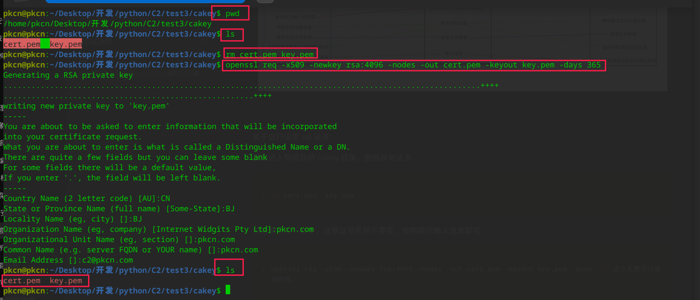

# README
# **介绍**
这是一个由 Python3.7.3 编写的轻量级，便捷式的 C2 服务器程序，它采用 flask 框架来实现API接口式的数据交互，使用 socketserver 框架实现文件数据上传和下载，目前功能较少，主要是开发者没时间了，要去流水线打工混口饭吃了，如果后期有时间我会添加一些新功能。欢迎大家参与项目，一起学习和研究C2在攻防中的利用

服务端主要是负责提供统一控制API接口的，木马端和控制端的交互操作主要由该统一API接口来规定一个规范。


# **法律声明**
##### **此工具仅用来学习和研究C2服务的原理，不要用于未授权的非法攻击活动，如果使用者使用该工具用于从事非法攻击活动，由此产生的一切后果均由使用者承担，本人不对此负责！！！**
##### **此工具仅用来学习和研究C2服务的原理，不要用于未授权的非法攻击活动，如果使用者使用该工具用于从事非法攻击活动，由此产生的一切后果均由使用者承担，本人不对此负责！！！**
##### **此工具仅用来学习和研究C2服务的原理，不要用于未授权的非法攻击活动，如果使用者使用该工具用于从事非法攻击活动，由此产生的一切后果均由使用者承担，本人不对此负责！！！**


# **优缺点介绍**
优点：

1、通过提供数据交互的API接口提供了一个统一的控制框架

2、木马端灵活自由，使用者可以使用自己喜欢的编程语言灵活开发对接C2服务器提供的API接口的程序来实现木马控制

3、环境依赖简单，对服务器要求低，可以快速便捷式部署

缺点：

1、成熟度较低，目前还属于实验性阶段

2、目前对使用者的门槛较高，需要自己开发木马(当然改改，用我提供的示例木马也行，但是我的木马上线windows时可能会出问题)

3、与其他成熟C2产品相比，功能较少，暂时还没有心脏跳动的检测功能

4、由于开发者的能力和经验有限，所以，代码质量不咋地


# **文件架构**
trojan.py    木马程序，如果要使用要修改里面的IP地址和端口

client.py    控制端程序，依赖 lib/basecli.py 文件，配置文件使用的是 settings.py

server.py    服务器程序，依赖 lib/baseser.py 文件，配置文件使用的是 settings.py

fileserver.py    文件上传下载服务器程序

start.py    可以运行此脚本来快速搭建服务


# **部署与使用**
部署：

非常简单，在填写好 settings.py 文件后，只需要使用 python3 运行 start.py 文件即可，等待其安装完依赖即可

```bash
python3 start.py
```
**注意：**

**在填写 settings.py 文件时要注意，里面的本地IP地址最好填写本地出网IP地址，linux使用 ifconfig 而 windows  使用 ipconfig 来看本地IP地址来填写，而不是云服务器的公网IP地址**


控制端使用：

也非常简单，也是填写好 settings.py 文件后，安装一下依赖，只需要使用 python3 运行 client.py 文件即可

```bash
pip3 install -r requirements.txt
python3 client.py
```
```bash
查看当前上线主机
  getlive

对上线主机进行操作
  set 主机ID 操作[shell,time,uploadfile,downfile,del,frp] 参数

 例：
  set 主机ID shell 你要执行的系统命令
  set 主机ID time 你要设定的时间(如果时间小于零则默认设置为10)
  set 主机ID uploadfile 要上传的文件路径 目标路径
  set 主机ID downfile 目标文件路径
  set 主机ID del(删除主机)
  set 主机ID shell exit_yes(执行此命令木马会停止运行)
  set 主机ID frp windows/linux(这里是指定目标机的系统平台):x64/x86(指定使用 frp 程序架构) 端口号

查看帮助
  help

要退出请按两次 ctrl + c

```


视频教程：[https://www.bilibili.com/video/BV1NY4y1p7QG](https://www.bilibili.com/video/BV1NY4y1p7QG)


# **功能解析**
### **统一控制API接口**
##### 木马通信唯一ID和AES秘钥分发接口：/getkeys
该接口的秘钥实现依赖 ./lib/baseser.py 文件中的 getkeys() 方法

该接口下发秘钥数据经过base64位加密后保存在响应头的 Cookie 中，木马请求这个接口下发的通信ID和AES秘钥都是随机生成的MD5值，木马要与服务器通信就需要其唯一身份ID和使用下发的随机AES秘钥对数据进行加密，即每一个身份ID都对应者一个AES秘钥。秘钥下发成功则响应状态码为 404 ，失败则为 200，秘钥下发后就会设置一个木马唯一身份ID值绑定的任务 {"sleeptime":"","cdm":"getlive"}，而木马要成功上线就要根据下发的唯一身份ID和AES秘钥来请求执行该任务才能完成上线


将密文解密后可以得到数据，格式为 json 格式


##### payload 分发接口：/getname
该接口依赖 ./lib/baseser.py 中的 getpayloads() 方法

木马需要请求该接口才能获取到 payload ，而木马请求该接口则需要在请求头中的Cookie部分放入自己的 cid = 唯一身份ID，任务下发成功返回 404 否则返回 200


将数据进行解密后


##### 木马执行后返回结果接口：/addrst
该接口依赖 ./lib/baseser.py 中的 add\_rst() 方法

木马要返回执行 payload 后的数据则需要在请求头的Cookie部分放入自己的 cid = 唯一身份ID，在请求体部分的 data 参数中放入AES加密的数据，返回结果成功则返回 404 ，否则返回 200

请求头

```python
{"Cookie":"cid=木马的唯一身份ID"}
```
请求体

```python
{"data":AES加密后的内容} #AES加密的数据内容如图木马程序调试可见
```
木马返回执行结果的数据解析


##### 控制端获取当前已经上线主机信息接口：/getlive
控制端要得到当前主机存活信息就要构造如下请求信息

请求头：

```python
{"pwd":密码加密后MD5值}
```
身份验证成功后即可如图得到响应的信息


##### 控制端向服务器发布任务接口：/addtask
该接口依赖 ./lib/baseser.py 中的 add\_task() 方法

当控制端发送下发任务请求时，该接口会检查控制端的密码，然后根据控制端提供木马唯一ID进行ID合法性校验，校验成功后就会将 cmd 里密文进行解密后与该木马的唯一ID进行绑定，木马请求下载 Payload 时就根据其自身的ID获取对应的任务

控制端要构造如下请求头

```python
{"pwd":MD5加密的密码,"key":木马唯一身份ID,"cmd":base64密文}
base64密文：{"sleeptime": "", "cdm": "你要执行的命令"}
```
成功则响应状态码为 200

```python
响应正文：{"info":发布成功或失败的提示信息}
```


##### 处理控制端要删除某台上线主机的接口：/killhost
该接口依赖 ./lib/baseser.py 中的 del\_*host\_*info() 方法

当控制端请求该接口时，首先会校验控制端提供的密码是否合法，然后校验提供的木马唯一ID值是否合法，校验成功后，就会根据其提供的木马的唯一ID值来清除服务器存储的木马的唯一ID值和其ID绑定的 AES 秘钥

请求正文

```python
{"pwd":MD5加密后的密码,"key":木马唯一ID}
```
200响应成功，响应正文

```python
{"info":"成功或失败的提示信息"}
```


##### 控制端获取木马执行结果的API接口：/getrst
请求头

```python
{"pwd":MD5加密的密码}
```
响应正文

```python
{'target1': {'key': '木马唯一身份ID', 'data': {'localuser': '当前上线主机用户名称', 'sys_info': '主机系统架构', 'local_ip': '本地IP地址', 'cdm': '执行的任务', 'data': '任务执行结果', 'remote_ip': '出口公网IP地址'}}}
```


##### 用于文件传输处理的API接口：/fileserver
该接口依赖 ./fileserver.py 文件

控制端请求该接口时，如果信息验证成功就会启动 fileserver.py 文件，而该文件提供的文件代理传输服务则需要占用服务器的 60000 号端口，所以在使用时请确保服务器的 60000 号端口是可用的，否则可能会出现一些未知问题。

要访问该接口需要构造如下参数：

请求体

```python
{'pwd': 'MD5加密的密码', 'key': '木马唯一身份ID', 'cmd': 'base64密文'}
```
响应结果

```python
{"info":"执行成功或失败信息"}
```
效果如图控制端调试


##### 用于一键部署 FRP 的API接口：/frpserver
控制端访问该接口时，如果信息验证成功，则会启动 ./software/frp/frpserver 程序文件，它会按照你输入的端口提供一个 socks5 的代理服务。需要注意的是，你输入的端口和该端口的下一个端口 (如你输入的端口为 3344 而服务端也要占掉另外一个端口 3345) 要保证能够正常使用和对外访问

由于要完成此服务的搭建需要联动的接口较多，这里就不再赘述，更多详情可以查阅源代码


# **功能服务结构图**
主体功能逻辑，具体请看源代码


文件数据传输代理服务逻辑，具体请看源代码


# **关于自行设定 ssl 证书**
首先进入到项目的 cakey 目录，删除原有证书

```bash
rm cert.pem  key.pem
```
然后使用如下命令，注意证书名称不要变，按照提示输入信息即可

```bash
openssl req -x509 -newkey rsa:4096 -nodes -out cert.pem -keyout key.pem -days 365(这个天数可以适当修改)
```


然后重启服务，在浏览器访问查看证书


